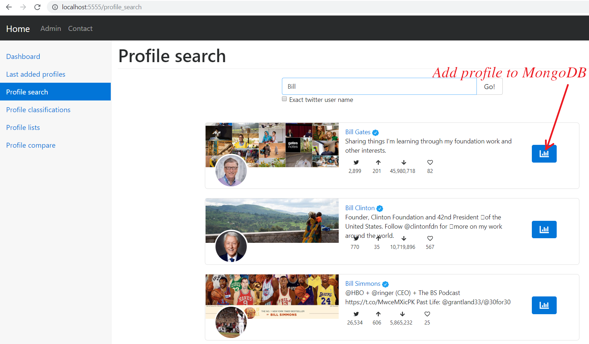

# Twitter-Sentiment-Analyzer
Twitter Sentiment Analyzer

Steps to start this project:-

1- Create your own MongoDB with these tables:-

2- Start MongoDB server.

3- Add your Twitter API keys to secrets.py

4- Search for new profiles and add them to MongoDB

Enjoy Twitter Sentiment Analysis ;-)

Watch it on action

