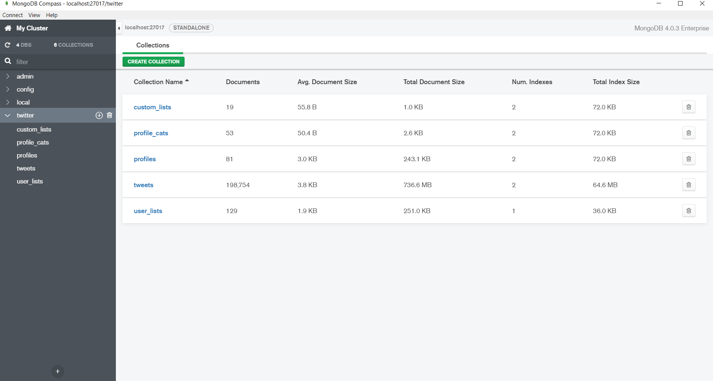

# Twitter-Sentiment-Analyzer
Twitter Sentiment Analyzer

Steps to start this project:-

1- Create your own MongoDB with this tables:-

3- Start MongoDB server.

2- Add your Twitter API keys to secrets.py

Enjoy Twitter Sentiment Analysis ;-)

Watch it on action

